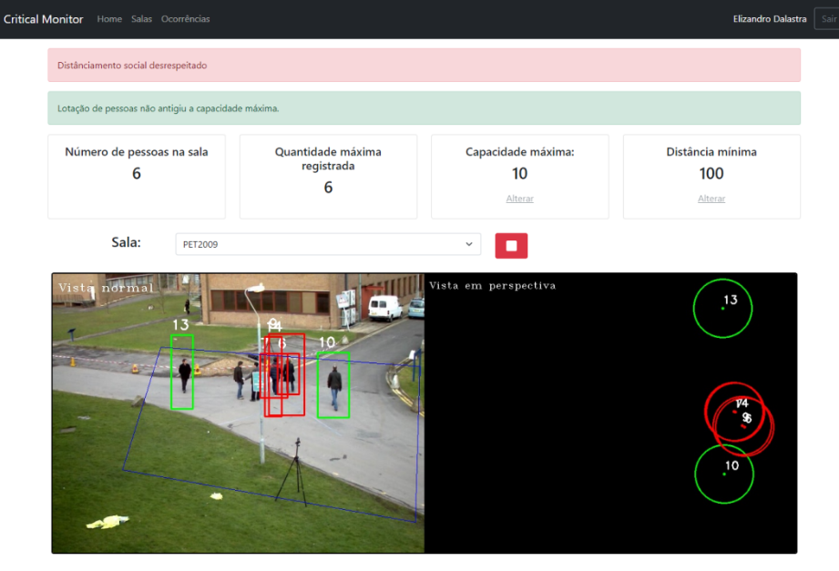
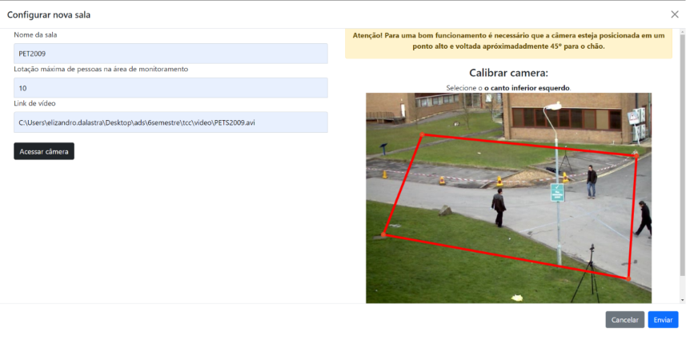
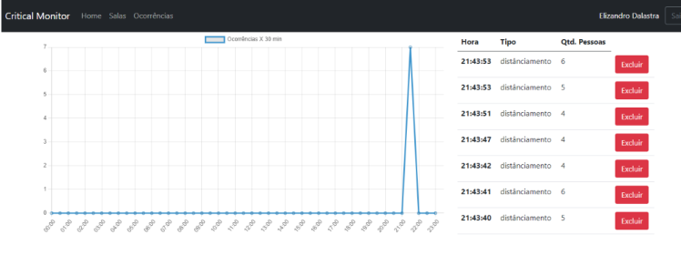

# Critical Monitor

Software de monitoramento e contagem de pessoas por meio de Visão Computacional. [Artigo Completo](assets/artigo-critical-monitor-elizandro-dalastra.pdf)


**Tela de Monitoramento**



**Tela de Configuração**



**Registros de alertas**




---

## Descrição

Critical Monitor é um software que objetiva realizar o monitoramento e contagem de pessoas por meio de Visão Computacional, desenvolvido como Trabalho de Conclusão de Curso de Análise e Desenvolvimento de Sistemas, do Instituto Federal de Educação Ciência e Tecnologia do Rio Grande do Sul - Câmpus Sertão. O Sistema é capaz monitorar situações críticas de contágio do vírus SARS-CoV-2, para assim gerar alertas sobre descumprimentos das normas de lotação máxima em ambientes internos e istanciamento social.

---

## Recursos

- Manter usuário.
- Autenticar usuário.
- Controlar configurações.
- Controlar histórico de ocorrências.
- Controlar a calibração da câmera.
- Capturar imagens da câmera.
- Detectar pessoas em imagens.
- Aferir o distanciamento entre pessoas detectadas.
- Permitir monitorar ambientes em tempo real.
- Disparar alertas para o usuário.

---

## Instalação

Instruções passo a passo sobre como instalar o projeto localmente.

```bash
# Clone este repositório
git clone https://github.com/edalastra/Critical-Monitor

# Entre no diretório
cd Critical-Monitor

# Execute com docker compose
docker-compose up -d
```

---

## Tecnologias

- Flask
- PostgreSQL
- Tensorflow
- OpenCV
- Bootstrap Jquery
- Jinja
